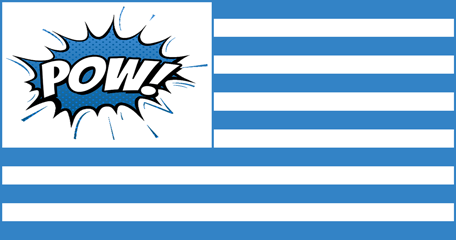

 

 

# .Net Pow! Flags     

The goal of this project was to provide a flag icon library that developers could use to generate the styles needed for a given project.
The base distribution should be enough for most projects but you can generate your own using the .Net Pow! Web Icons project.

 

## Continued Development and Support
If this has helped you or your organization out any contributions are greatly appreciated.

<form action="https://www.paypal.com/cgi-bin/webscr" method="post" target="_top">
<input type="hidden" name="cmd" value="_donations" />
<input type="hidden" name="business" value="MDV5TYFN6S89A" />
<input type="hidden" name="currency_code" value="USD" />
<input type="image" src="https://www.paypalobjects.com/en_US/i/btn/btn_donateCC_LG.gif" border="0" name="submit" title="PayPal - The safer, easier way to pay online!" alt="Donate with PayPal" />

</form>

 
 

## Images

All of the flag images (except the **.Net Pow! Flags**) are available and supplied from [Flagpedia](https://flapedia.net/download) and available in **PNG**, **WebP** and **JPEG** formats 
with resolutions by width or height. **.Net Pow! Flags** uses the `*.png`files. 

 
 

## License

See [License](https://github.com/dot-net-pow/dot-net-pow-flags/master/LICENSE.md)